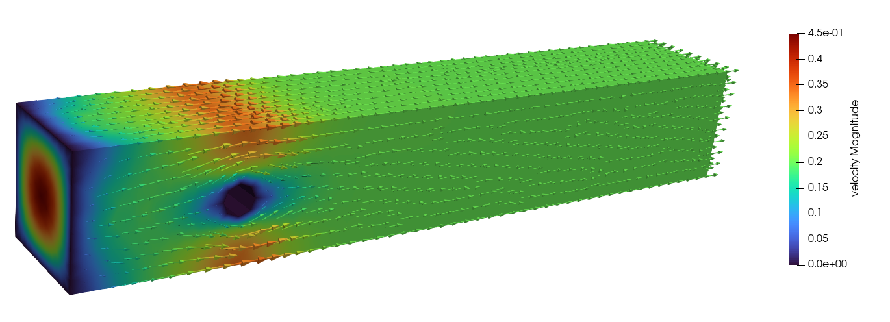
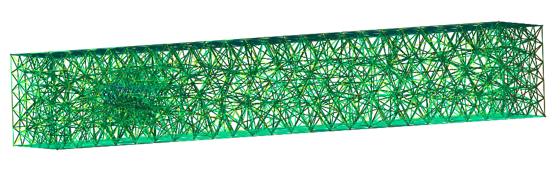

## Mathematical Introduction
---

The incompressible, unsteady Navier-Stokes equations govern the motion of viscous fluid flow, essential for understanding laminar flow around cylindrical obstacles. These equations are expressed as:

$$
\begin{cases}
\cfrac{\partial \mathbf{u}}{\partial t} - \nu \Delta \mathbf{u} + (\mathbf{u} \cdot \nabla)\mathbf{u} + \nabla p = \mathbf{f}, & \text{in } \Omega, \\
\nabla \cdot \mathbf{u} = 0, & \text{in } \Omega,\\
\text{B.C. } & \text{on }  \Gamma
\end{cases}
$$

where $\mathbf{u}$ denotes the velocity vector, $p$ is the pressure, $\nu$ represents the kinematic viscosity, and \(\mathbf{f}\) is the external forcing term.

To numerically solve this problem, we utilize the finite element method (FEM), applying Taylor-Hood finite elements, which are inf-sup stable. The equations are reformulated in a weak form and discretized using the Galerkin method, creating finite-dimensional spaces for velocity and pressure, facilitating stable solutions without spurious modes.

A semi-implicit backward Euler scheme is employed for time discretization, where the nonlinear terms are advanced explicitly. This scheme simplifies the nonlinear system to a linear system solved iteratively at each time step, reducing computational intensity and improving stability for laminar flow simulations.

This formulation enables simulations around cylinders, where the study’s focus is on drag and lift forces characterized by the Reynolds number, which indicates flow stability and transition to turbulence at higher values.
## Implementation and Results

A C++ implementation using the deal.II library was developed to solve the incompressible Navier-Stokes equations for laminar flow around cylinders. The project integrates various preconditioners and employs MPI for parallelization, enhancing computational performance. Simulations were conducted on both 2D and 3D meshes generated with Gmsh, demonstrating accurate flow characterization and efficient convergence. The results confirm the effectiveness of the implemented strategies, achieving substantial improvements in handling complex, large-scale simulations.




## Mesh
The 2D and 3D meshes generated with Gmsh for the simulations are located in the mesh folder. 
For 2D simulations, the file "mesh_2D_coarse" can be used. 
For 3D simulations, a variety of meshes are available, ranging from the coarser "mesh-0.1" to the finer "mesh-0.0125."



## Src
The source code is organized into three main files:

- main.cpp: This file handles the general execution of the program. It serves as the entry point, calling functions, and managing the overall process.
- Navier_Stokes.cpp: This file contains the implementation of all functions needed to assemble and solve the Navier-Stokes equations.
- Navier_Stokes.hpp: This header file contains the declarations of all the classes and function prototypes used in the project. It defines the data structures and interfaces ecessary for the implementation in Navier_Stokes.cpp.

# Compiling

To build the executable, make sure you have loaded the needed modules with
```
module load gcc-glibc dealii
```
Then run the following commands:
```
mkdir build
cd build
cmake ..
make
```
The executable will be created into build, and can be executed through ./executable-name.

By executing only ./executable-main, the program will be executed with default paramenters;
to change the parameters of the simulation run:
```
./executable-name --flag <value>
```
A helper function can be summoned by writing
```
./executable-name -h
```
or

```
./executable-name --help
```
